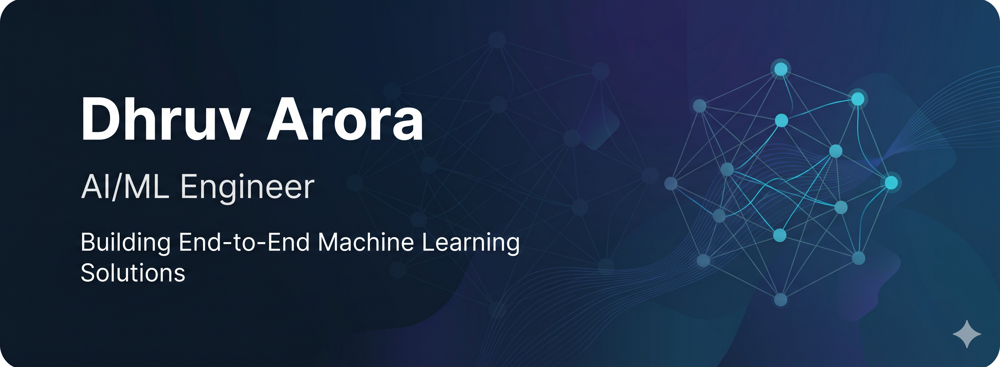

  

<h1 align="center">
Dhruv Arora
</h1>

<h3 align="center">
AI/ML Engineer | Mathematics Graduate
</h3>

Applying Mathematics, Statistics, and Machine Learning to build intelligent, data-driven solutions for real-world business problems.

  

  

  

## 👨‍💻 About Me

I am a **Mathematics graduate from Hansraj College, University of Delhi**, with a strong foundation in **Machine Learning, Statistics, and Data Analytics**.

I enjoy designing end-to-end machine learning solutions that transform raw data into meaningful business insights. My experience spans the complete ML lifecycle—from data preprocessing and feature engineering to model development, evaluation, and interactive business intelligence dashboards.

I believe good machine learning is not just about building accurate models, but about developing reliable, interpretable, and practical solutions that support better decision-making.

## 🛠️ Tech Stack

### Languages

  

### Data Science & Machine Learning

  
  

### Data Visualization & Business Intelligence

  
  

### Tools & Development

  
  

## 🚀 Featured Projects

<table>
<tr>
<td width="50%">

### 🏦 CreditWise Loan Approval System

End-to-end machine learning pipeline for loan approval prediction featuring advanced preprocessing, feature engineering, model comparison, and business-focused evaluation.

**Tech Stack**

Python • Scikit-learn • Pandas • NumPy • Matplotlib

</td>

<td width="50%">

### 🎓 Student Performance Analysis

Regression-based predictive analytics project comparing multiple machine learning models using cross-validation and hyperparameter tuning.

**Tech Stack**

Python • Scikit-learn • Pandas • NumPy

</td>
</tr>

<tr>
<td width="50%">

### 📈 Sales Performance Dashboard

Interactive Power BI dashboard built using 200K+ retail transactions to uncover revenue trends, profitability, and regional business insights.

**Tech Stack**

Power BI • Python • Excel

</td>

<td width="50%">

### 🛒 Retail Grocery Dashboard

Business Intelligence dashboard designed using Star Schema modelling with interactive KPIs, regional analysis, and executive reporting.

**Tech Stack**

Power BI • DAX • Excel

</td>
</tr>
</table>
---

## 🎯 Current Focus

- 🤖 Building end-to-end Machine Learning projects with production-ready code.
- 🚀 Learning model deployment and MLOps fundamentals.
- 📊 Strengthening Data Structures, SQL, and Python for technical interviews.
- 💼 Preparing for entry-level AI/ML Engineer opportunities.

## 📈 GitHub Statistics

## 🎓 Certifications

- **AI/ML & Data Analytics** — Apna College
- **Data Analytics & Visualization with Microsoft Power BI** — IIM Bangalore (SWAYAM)
- **Data Analytics with Python** — NPTEL
- **McKinsey Forward Program**

---

## 🤝 Let's Connect

I'm always interested in discussing Machine Learning, Data Science, analytics, and opportunities to build impactful solutions.

💻 GitHub : https://github.com/dhruvarora2004/

⭐ Thank you for visiting my profile.
